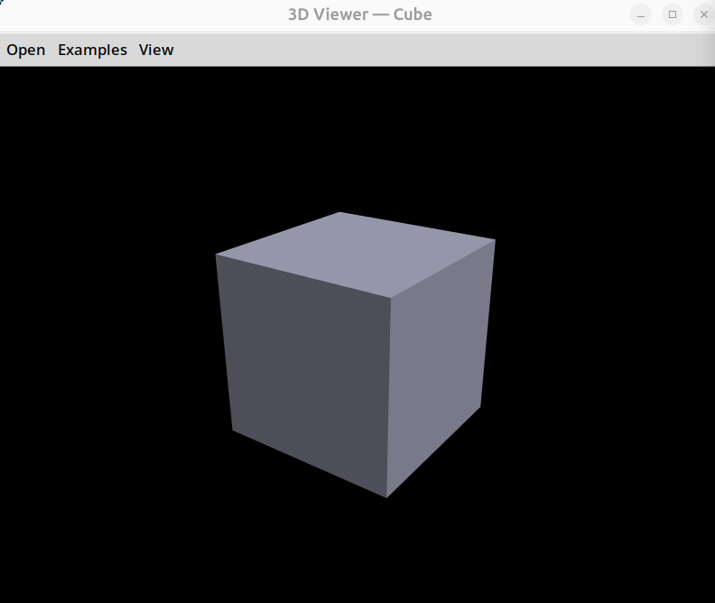
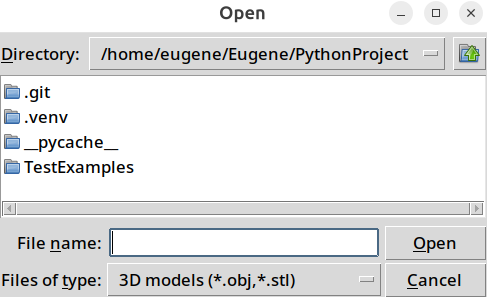

# PythonProject

## Идея проекта

Приложение для просмотра трёхмерных объектов из файлов форматов `.stl` и `.obj`.  
Проект позволяет загружать 3D-модели, отображать их геометрию (вершины, рёбра, грани) и смотреть разного рода информацию про модель.

## Установка зависимостей и запуск

Чтобы установить зависимости, запустите команду:

**pip install -r requirements.txt**

Чтобы запустить приложение, запустите код:

**python3 main.py**

## Пример интерфейса

## Участники

- **Один участник** (выполнение работы индивидуально)

## Ссылка на репозиторий

[https://github.com/Eugene9937/PythonProject](https://github.com/Eugene9937/PythonProject)

## Фичи (итерация 1)

1. **Самостоятельный парсинг файлов** `.obj` и `.stl` — извлечение вершин, граней/полигонов без использования готовых библиотек.
2. Загрузка файла через диалоговое окно.
3. Базовое отображение геометрии (каркасный режим / wireframe) загруженной модели.
4. Возможность вращать и масштабировать сцену мышью (камера вокруг центра объекта).

## Фичи (итерация 2)

1. Добавление текстур (UV-развёртка для `.obj` и простой цвет/шаблон для `.stl`).
2. Переключение между режимами отображения: каркас, сплошной цвет, текстура.
3. Отображение информации о модели (количество вершин, граней, полигонов, наличие текстурных координат).

## Библиотеки

1. **PyOpenGL** — Python-биндинг к OpenGL. Используется для рендеринга 3D-графики, управления камерой, освещением и текстурами.

2. **tkinter** — Будет использоваться для GUI. Интеграция с OpenGL осуществляется через виджет `tkinter_gl`.
